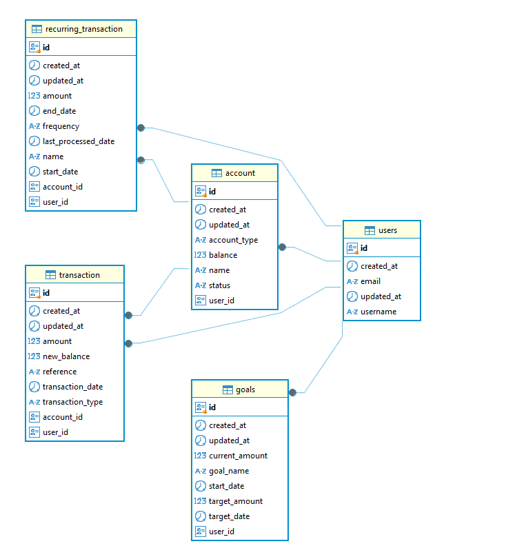

# Personal Finance App

The Personal Finance App is designed to help users manage their financial transactions and track their expenses efficiently. It provides features for exporting transaction data, viewing transaction history, managing user accounts, setting financial goals, and handling recurring transactions.

- **Users**: Can manage their own financial transactions, set personal goals, handle recurring payments, and export their transaction history. They can only view and modify their own data.



**Note:** The service is running on a free tier on render.com, so performance may be limited. You can access it here: [Task Tracker Service](https://task-tracker-w7g0.onrender.com/projects)

## Table of Contents

- [Features](#features)
- [Technologies](#technologies)
- [Getting Started](#getting-started)
  - [Prerequisites](#prerequisites)
  - [Installation and Running the application](#installation-and-running-the-application)
- [Usage](#usage)
- [API Documentation](#api-documentation)
- [Contact](#contact)

## Features

- **Expense Tracking:** Effortlessly log, categorize, and monitor your financial transactions to gain better control over your spending.
- **Goal Management:** Set financial goals, and track your progress in real-time to stay on top of your financial health.
- **Recurring Transactions:** Automate recurring payments and income to save time and avoid missed deadlines.
- **Data Export:** Export transaction histories and reports for deeper analysis or record-keeping.
- **Privacy-First Design:** Ensure your data is secure and accessible only to you.

## Technologies

- **Core Frontend Technologies:** React, React Router, React Hook Form, useSWR, Yup
- **UI & Styling:** Tailwind, React-icons, Normalize.css
- **Date Management:** date-fns
- **Development Tools:** TypeScript, Vite, ESLint, Prettier, Nodemon
- **Containerization:** Docker
- **Backend:** Spring Boot, Spring Data JPA, Spring Security, Spring Validation, OpenAPI
- **Database:** PostgreSQL
- **Others:** dotenv (for environment variables), Lombok, Maven

## Getting Started

### Prerequisites

List the software and tools required to run the application.

```bash
- Docker  (for backend development)
- Node.js (for frontend development)
```

### Installation and Running the application

1. Clone the repository:

   ```bash
   git clone https://github.com/sunk4/personal_finance
   ```

2. Build backend services using Docker Compose:

   ```bash
   docker-compose up --build
   ```

   > **To stop the backend**, press `Ctrl+C` in the terminal, or run the following in another terminal:

   ```bash
   docker-compose down
   ```

3. Set up keycloak

   - **Access Keycloak**: Open your browser and go to [http://localhost:8080](http://_vscodecontentref_/1). Log in with the admin credentials specified in the [docker-compose.yml](http://_vscodecontentref_/2) file (`admin/admin`).

   - **Create a Client**:
   - In the new realm, go to the "Clients" section and click "Create".
   - Enter the client ID (e.g., [frontend](http://_vscodecontentref_/3)) and select "OpenID Connect" as the client protocol.

   - **Configure Client**:
   - Set "Root URL" to `http://localhost:5174`.
   - Set "Home URL" to `http://localhost:5174`.
   - Set "Valid reciderect Uris" to `http://localhost:5174/*`.
   - Valid post logout redirect URIs to `http://localhost:5174/login`.
   - Web origins to `http://localhost:5174`.

4. Run backend services using command in termin:

   ```bash
   mvn spring-boot:run
   ```

5. Open a new terminal for the frontend, and navigate to the frontend directory:

   ```bash
   cd frontend
   ```

6. Install the frontend dependencies:
   ```bash
   npm install
   ```
7. Generate api:
   ```bash
   npm run generate-api
   ```
8. Run the frontend application:
   ```bash
   npm run dev
   ```

### Usage

Once the backend and frontend are running, follow these steps to use the application:

1. **Access the application**:

   - Open your browser and navigate to `http://localhost:5174` to access the frontend of the application.

2. **Backend API**:

   - The backend API is running at `http://localhost:8088`. You can interact with it via tools like Postman or Curl.
   - Example: If it's a REST API, you can try an endpoint like:
     ```bash
     curl http://localhost:8088/api/v1/hello_world/public
     ```

3. **Using PostgreSQL**:
   - The PostgreSQL database is running in a container at `localhost:54320`.
   - You can connect to it using a PostgreSQL client or via CLI using:
     ```bash
     psql -h localhost -p 54320 -U root -d task_tracker
     ```

## API Documentation

You can access the API documentation using the following links:

- [Swagger UI](http://localhost:8088/api/v1/swagger-ui/index.html)
- [OpenAPI JSON](http://localhost:8088/api/v1/v3/api-docs)

## Contact

If you have any questions or feedback, feel free to reach out:

- **Email:** trnka.roman.careers@gmail.com
- **LinkedIn:** [Roman Trnka](https://www.linkedin.com/in/roman-trnka-938666169/)
- **GitHub:** [sunk4](https://github.com/sunk4/personal_finance)
